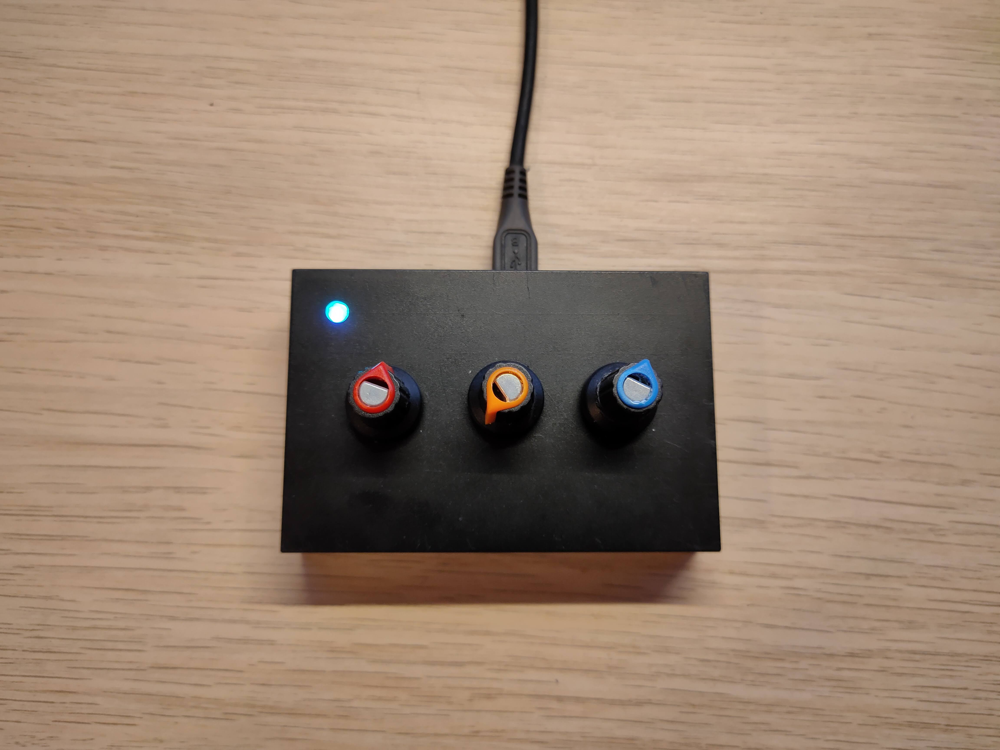
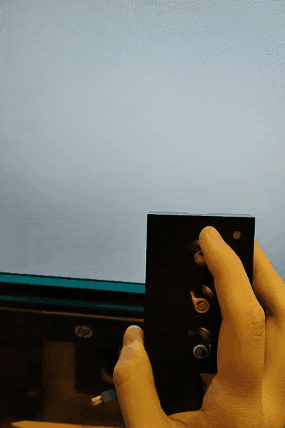

# VolumeRotaryEncoder
A simple Arduino-based device to control volume (or actually everything) via hardware dials

## What for?

- Hardware control for volume and media playback when the keyboard does not have the dedicated buttons for that
- Custom knobs to use in macros or shortcuts

## Hardware

A hardware only consists of Arduino Pro Micro (with 32u4 chip), three click-enabled rotary encoders, and an RGB LED (in this one, the WS2812-based LED is used). Author's build is housed in a rough looking case with a rough looking dial knobs.

## Software

The software part is an Arduino sketch to emulate a bunch of hardware keyboard buttons on certain encoder actions.

For example, by default the left knob controls the volume (by emulating the hardware volume up/down keys), and the right knob emulates arrow keys:

 

## Features

- Multiple layers 
  - 0 (cyan) - Emulating multimedia keys and arrows
  - 1 (yellow) - Emulating F13+ keys (for binding them as a shortcut key in certain apps)
  - 2 (purple) - Printing what was pressed to serial port (for reading that info and scripting something on PC in, say, Python)
  - 3 (blue) - Emulating <, >, +, -, left and right arrows (for Lightroom batch photo editing)
  - 4 (green) - Left knob for multimedia, middle one for up/down/enter, right one for F13/F14/F15
- Indicating current layer via LED
- Indicating an encoder event via LED
- RGB lights!

## Build your own
1) Buy all components
2) Wire them up
3) Download the sketch and the required libraries
4) Adjust the pins that the encoders and LED are attached to
5) Build and upload firmware
6) Enjoy!
